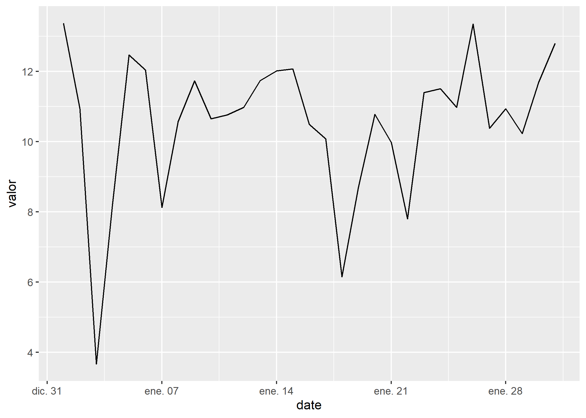
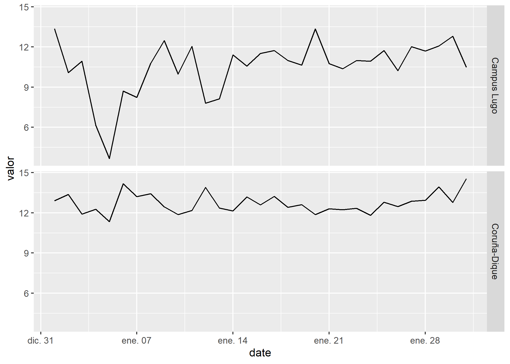
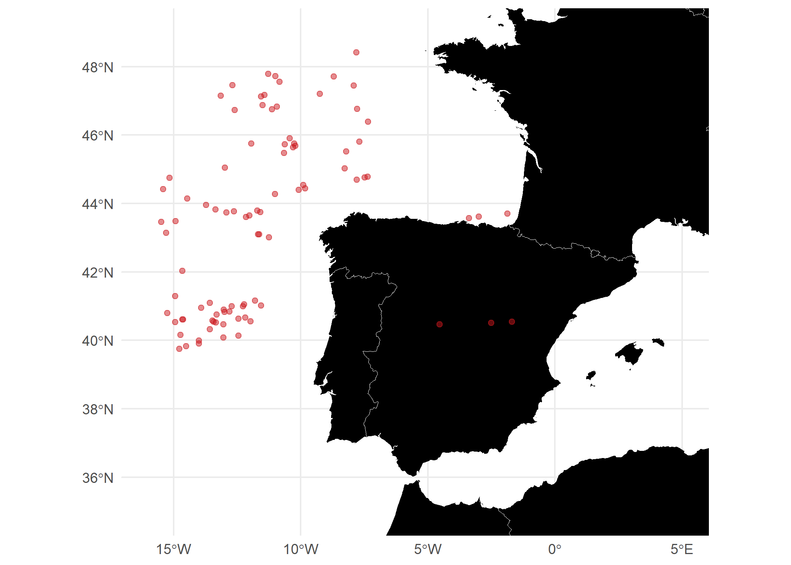

Download functions for Meteogalicia
================
Dominic Royé
20/02/2019

At this moment two functions are available to download data of the Galician Weather Service.

1.  Lightning strike data.

2.  Daily meteorological variables.

Meteorological data
-------------------

``` r
#install the libraries if necessary
if(!require("tidyverse")) install.packages("tidyverse")
if(!require("XML")) install.packages("XML")
if(!require("jsonlite")) install.packages("jsonlite")
if(!require("sf")) install.packages("sf")
if(!require("rnaturalearth")) install.packages("rnaturalearth")


#packages for functions
library(tidyverse) #+plotting
library(XML)
library(jsonlite)

#packages for plotting
library(sf)
library(rnaturalearth)

#functions
source("meteo_daily_download.R") #meteo download
source("lightning_download.R") #lightning download

#station details
load("altabaja.RData")
load("idestaciones.RData")
load("idparametros.RData")
```

The following tables include important details about station ids, longitude, latitude, operative stations, available variables, etc.

``` r
#stations id + latlon + place
str(idestaciones)
```

    ## 'data.frame':    149 obs. of  8 variables:
    ##  $ concello  : chr  "A CORUÑA" "A CORUÑA" "A CORUÑA" "ABEGONDO" ...
    ##  $ estacion  : chr  "Coruña-Torre de Hércules" "Coruña-Dique" "Coruña-Bens" "Mabegondo" ...
    ##  $ idEstacion: int  10157 14000 14010 10045 14003 10144 19005 19012 10095 10800 ...
    ##  $ lat       : num  43.4 43.4 43.4 43.2 43.3 ...
    ##  $ lon       : num  -8.41 -8.37 -8.44 -8.26 -8.53 ...
    ##  $ provincia : chr  "A Coruña" "A Coruña" "A Coruña" "A Coruña" ...
    ##  $ utmx      : chr  "547855.0" "550664.0" "545224.0" "559899.0" ...
    ##  $ utmy      : chr  "4803491.0" "4801545.0" "4801320.0" "4787883.0" ...

``` r
#information about which stations are operative (FechAlta: from, FechaBaja: to)
str(altabaja)
```

    ## 'data.frame':    171 obs. of  4 variables:
    ##  $ IdEstacion    : num  10045 10046 10047 10048 10049 ...
    ##  $ NombreEstacion: Factor w/ 171 levels "A Armenteira",..: 86 88 119 103 51 47 100 36 71 89 ...
    ##  $ FechaAlta     : Date, format: "2000-01-18" "2000-02-03" ...
    ##  $ FechaBaja     : Date, format: NA NA ...

``` r
#id_names for all available variables
str(idparametros)
```

    ## 'data.frame':    2900 obs. of  14 variables:
    ##  $ ID                : chr  "ID10157" "ID10157" "ID10157" "ID10157" ...
    ##  $ codigoParametro   : chr  "%INS_RATIO_1.5m" "BH_SUM_1.5m" "DV_CONDICION_10m" "DVP_MODA_10m" ...
    ##  $ lnCodigoValidacion: int  1 1 1 1 1 1 1 1 1 1 ...
    ##  $ nomeParametro     : chr  "Insolación" "Balace hídrico" "Dirección do refacho a 10m" "Dirección do vento predominante a 10m" ...
    ##  $ unidade           : chr  "%" "L/m2" "º" "º" ...
    ##  $ valor             : num  39.8 -2.81 220 225 2.81 ...
    ##  $ id                : num  10157 10157 10157 10157 10157 ...
    ##  $ concello          : chr  "A CORUÑA" "A CORUÑA" "A CORUÑA" "A CORUÑA" ...
    ##  $ estacion          : chr  "Coruña-Torre de Hércules" "Coruña-Torre de Hércules" "Coruña-Torre de Hércules" "Coruña-Torre de Hércules" ...
    ##  $ lat               : num  43.4 43.4 43.4 43.4 43.4 ...
    ##  $ lon               : num  -8.41 -8.41 -8.41 -8.41 -8.41 ...
    ##  $ provincia         : chr  "A Coruña" "A Coruña" "A Coruña" "A Coruña" ...
    ##  $ utmx              : chr  "547855.0" "547855.0" "547855.0" "547855.0" ...
    ##  $ utmy              : chr  "4803491.0" "4803491.0" "4803491.0" "4803491.0" ...

### Example

Lugo-Campus with maximum temperature (1.5m) in January 2019.

``` r
#downloading data
data <- import_meteo_daily(10053,         #station id
                           "TA_MAX_1.5m", #variable id
                           "01/01/2019",  #date from
                           "31/01/2019")  #date to 

#data structure
str(data)
```

    ## 'data.frame':    31 obs. of  12 variables:
    ##  $ concello          : chr  "LUGO" "LUGO" "LUGO" "LUGO" ...
    ##  $ estacion          : chr  "Campus Lugo" "Campus Lugo" "Campus Lugo" "Campus Lugo" ...
    ##  $ idEstacion        : int  10053 10053 10053 10053 10053 10053 10053 10053 10053 10053 ...
    ##  $ provincia         : chr  "Lugo" "Lugo" "Lugo" "Lugo" ...
    ##  $ utmx              : chr  "618455.0" "618455.0" "618455.0" "618455.0" ...
    ##  $ utmy              : chr  "4761028.0" "4761028.0" "4761028.0" "4761028.0" ...
    ##  $ codigoParametro   : chr  "TA_MAX_1.5m" "TA_MAX_1.5m" "TA_MAX_1.5m" "TA_MAX_1.5m" ...
    ##  $ lnCodigoValidacion: int  1 1 1 1 1 1 1 1 1 1 ...
    ##  $ nomeParametro     : chr  "Temperatura máxima a 1.5m" "Temperatura máxima a 1.5m" "Temperatura máxima a 1.5m" "Temperatura máxima a 1.5m" ...
    ##  $ unidade           : chr  "ºC" "ºC" "ºC" "ºC" ...
    ##  $ valor             : num  13.37 10.94 3.67 8.23 12.47 ...
    ##  $ date              : Date, format: "2019-01-01" "2019-01-02" ...

``` r
#plotting time serie
ggplot(data,
       aes(date,valor))+
          geom_line()
```



It is possible to query several stations or variables at the same time. However, the limit is set at 3 months for a single station and variable.

``` r
#downloading data
data <- import_meteo_daily(c(10053,14000), #station id
                           "TA_MAX_1.5m",  #variable id
                           "01/01/2019",   #date from
                           "31/01/2019")   #date to 

#data structure
str(data)
```

    ## 'data.frame':    62 obs. of  12 variables:
    ##  $ concello          : chr  "LUGO" "A CORUÑA" "LUGO" "A CORUÑA" ...
    ##  $ estacion          : chr  "Campus Lugo" "Coruña-Dique" "Campus Lugo" "Coruña-Dique" ...
    ##  $ idEstacion        : int  10053 14000 10053 14000 10053 14000 10053 14000 10053 14000 ...
    ##  $ provincia         : chr  "Lugo" "A Coruña" "Lugo" "A Coruña" ...
    ##  $ utmx              : chr  "618455.0" "550664.0" "618455.0" "550664.0" ...
    ##  $ utmy              : chr  "4761028.0" "4801545.0" "4761028.0" "4801545.0" ...
    ##  $ codigoParametro   : chr  "TA_MAX_1.5m" "TA_MAX_1.5m" "TA_MAX_1.5m" "TA_MAX_1.5m" ...
    ##  $ lnCodigoValidacion: int  1 1 1 1 1 1 1 1 1 1 ...
    ##  $ nomeParametro     : chr  "Temperatura máxima a 1.5m" "Temperatura máxima a 1.5m" "Temperatura máxima a 1.5m" "Temperatura máxima a 1.5m" ...
    ##  $ unidade           : chr  "ºC" "ºC" "ºC" "ºC" ...
    ##  $ valor             : num  13.37 13.37 10.94 12.26 3.67 ...
    ##  $ date              : Date, format: "2019-01-01" "2019-01-02" ...

``` r
#plotting time serie
ggplot(data,
       aes(date,valor))+
          geom_line()+
        facet_grid(estacion~.)
```



Lightning strikes
-----------------

``` r
#download lightning strikes
data <- lightning_download("01/01/2019","31/01/2019")

#data structure
str(data)
```

    ## 'data.frame':    90 obs. of  7 variables:
    ##  $ id         : Factor w/ 52 levels "0","1","2","3",..: 1 1 2 1 2 3 4 5 6 1 ...
    ##  $ horaUTC    : Factor w/ 89 levels "04:50:37","09:12:30",..: 1 9 10 2 4 5 7 8 11 3 ...
    ##  $ lat        : Factor w/ 90 levels "39.8288","40.0821",..: 11 7 8 6 9 3 10 1 4 2 ...
    ##  $ lon        : Factor w/ 90 levels "-11.9687","-12.2215",..: 11 10 8 7 3 4 2 9 6 5 ...
    ##  $ peakCurrent: Factor w/ 74 levels "-30","-32","-36",..: 4 9 6 8 1 3 2 11 7 10 ...
    ##  $ day        : int  1 5 5 6 6 6 6 6 6 7 ...
    ##  $ date       : Date, format: "2019-01-01" "2019-01-05" ...

``` r
#lonlat to numeric
data <- mutate(data,lon=as.numeric(as.character(lon)),
               lat=as.numeric(as.character(lat)))

data_sf <- st_as_sf(data,coords=c("lon","lat"))%>%
               st_set_crs(4326)

map_bg <- ne_countries(scale=10,returnclass = "sf")

#plotting
     ggplot()+
        geom_sf(data=map_bg,
                fill="black",
                colour="white",
                size=0.2)+
         geom_sf(data=data_sf,
                 colour="#cb181d",
                 alpha=0.5)+
           coord_sf(xlim=c(-16,5),
                    ylim=c(35,49))+
            theme_minimal()
```


